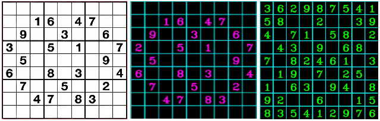
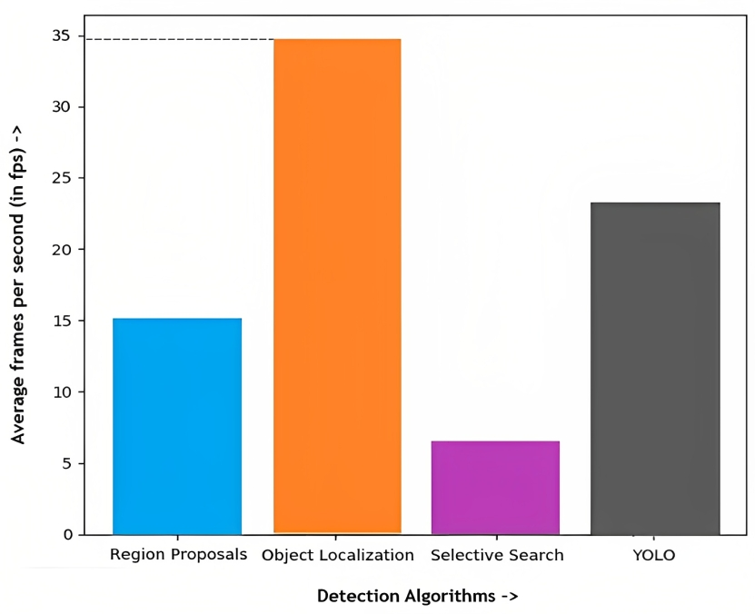

# Real-time Sudoku Solver using OpenCV and optimized Backtracking with an interactive input interface (webcam-based)

Sudoku is a popular puzzle that has held the interest of mathematicians for its complex possibilities of intermediate states. Generally, it takes from some minutes to even many hours to solve a single Sudoku based on its difficulty level. But, when it comes to computers, we can compute a solution in seconds. Thanks to the different algorithms that do so[2]. But that’s only when we have a proper matrix of integers (representing the board) available as an input to the algorithm. How often do we get a Sudoku board in such a format? Never. Thus, to address this issue, we have developed an all-in-one Sudoku solver! But first of all, let’s dive into the rules of the game.

## Rules of the game:

Sudoku is a number puzzle that can have multiple solutions. It’s played on a grid of 9 x 9 spaces. Within the rows and columns are 9 “squares” (made up of 3 x 3 spaces). Each row, column and square (9 spaces each) needs to be filled out with the numbers 1-9, without repeating any numbers within the row, column or square. Initial board configuration comprises some vacant squares and the remaining squares filled with a number (1 to 9) each. The task is to fill up those vacancies without violating any of the rules (mentioned above). When all the squares are filled, the puzzle is solved!

## Utility offered:

Considering the fact that Sudokus come in newspapers, magazines, books or even on mobile apps; all of which can be captured on camera, we have provided a live input capture feature via webcam(in PCs) / front camera(in smartphones). Now the user has to hold the puzzle in front of the device and the solved squares will be displayed in green on the live moving image of the board on the screen itself, that too in a matter of seconds. So we get to experience a hassle free, interactive interface and instant solution. It was never as easy as this to solve a Sudoku puzzle.

## Approach adopted:

The project is implemented in 4 key segments :-

- i) `Tracking the board` (in the frames of live video capture) and each and every box/cell in it distinctly. This also involves filters and pre-processing of the captured image with the help of OpenCV library functions.

- ii) `Recognition of digits(1-9)` from images of all 81 cells. Then a matrix of integers is made, inserting them one by one into it.

- iii) The matrix of integers (which represents the puzzle) is `fed to the optimized backtracking algorithm` for getting a solution matrix.

- iv) The solution matrix has to be `overlaid onto the live image of the puzzle board on the screen`, only highlighting the filled vacancies in green, using OpenCV again.

 

> 
 Fig. (i) Conversion to Grayscale Image (since color adds unnecessary complexity here)  

 

> 
 Fig. (ii) Drawing contours on blurred and grayscaled image for easy detection of board borders and corners  

 
<!--

-->

> 
  Fig. (iii) On the left : image of the puzzle (pre-recognition) At the center : image of the puzzle (post-recognition) On the right : image of the overlay matrix showing solved cells  

 

<!--  -->

> 
  Fig. (iv) Overlaying the solution matrix on top of the original board cell co-ordinates  

#### Elaborating on points (i) and (ii) above :-

In the pre-processing phase, image is binarized (RGB to grayscale), Gaussian blur is applied (to denoise unnecessary details), then contour mapping (for detecting borders (edges and vertices) of the board and that of each cell) and perspective warping. Next, the board is split into 81 images (each representing a cell)
Next, the array of images is fed, one image at a time, to the digit recognizer[1] (CNN(Convolutional Neural Network) based model trained on the MNIST dataset[3]) for identifying its numeric value (1-9).

## Alternative implementation:

Rather than replying on the assumption that the contour spanning maximum area will be the one we're concerned for (which might fail for puzzles with extra borders), there's a more accurate and reliable way to achieve the same outcome - by feeding the frame (captured live on camera) to an object localization model trained on sudoku board images collected from newspapers, magazines, websites or even hand-drawn ones. These can be augmented, if necessary, for variation and volume to attain a decent size of data instances (images) to train and test against.

Other detection algorithms: Sliding Window - an algorithm that makes use of a fixed set of sizes for windows viz. filters for scanning an image part by part while traversing through it (not quite effective for this problem specifically because it's not easy to predict the exact window-size which would match the actual size of the puzzle). Precision is critical for implementing Augmented Reality on the same detected area over the original image, hence can’t be compromised.

> 
  Fig. (v) A plot of the average frames per second for each of these detection algorithms.  

Besides, YOLO, Selective Search or Region Proposals combined with CNN yield good results. Howevery, they involve heavy computations which in turn slows down performance in terms of number of frames per second. A comparative depiction of the same is provided in the figure above.

## Scopes for Extension

QR-code scanning and identifying ArUco Markers are extended outcomes of the same idea that has led to quick and easy authentication of credentials and identity verification interfaces. Talking of board games, we can replace Sudoku with Chess and get live suggestions for the next move on screen (provided, the algorithm for Sudoku solving is replaced with the rules of Chess). Not to mention, we can do this with Tic-Tac-Toe as well. This shows how extensible the project is, as it’s applicable to almost any board game that involves informed decision making based on a definite set of rules and board positions. Even the model can be tweaked in a way to reveal only one cell value (instead of the complete solution) at a time which in turn will help the player to learn to play the moves one by one and reach the solution. This indeed is a promising feature to be adopted by games for interactivity in future.

---
